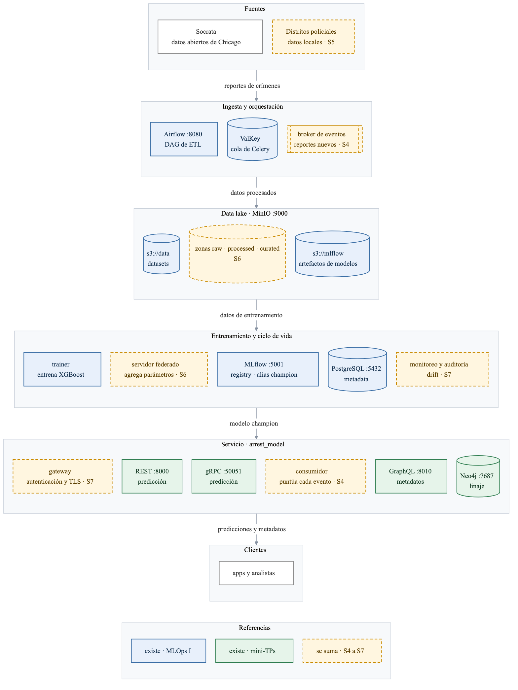

# Arquitectura del TP integrador

Plataforma de predicción en tiempo real de "ML Models & Something More Inc." que sirve el modelo XGBoost de arrestos en Chicago (2024). Nivel en contenedores.

Parte de la infraestructura del TP final de MLOps I y de los servicios de los mini-TPs, y suma una capa por sesión.

Equipo: trabajo individual. Bel Cattaneo cubre diseño, implementación y documentación.

Se levanta con `make stack-up`; el detalle está en [cómo levantarla](plataforma.md).

## Capas

| capa | componentes | qué hace |
|---|---|---|
| Ingesta y orquestación | Airflow | el DAG de ETL baja los reportes de Socrata y los procesa |
| Data lake | MinIO | guarda los datasets en tres capas —`raw`, `enriched` y `curated` de `s3://data`— y los artefactos de modelos (`s3://mlflow`) |
| Entrenamiento y ciclo de vida | Airflow, MLflow, PostgreSQL | el DAG `train_arrest_model` entrena sobre la capa curada y registra el modelo con el alias `champion` |
| Servicio | REST, gRPC, GraphQL con Neo4j | predicciones y metadatos del modelo `champion`, que trae su propia codificación adentro y recibe los campos crudos |

## Lo que se suma en cada sesión

Son propuestas que se ajustan con el material de cada sesión.

| sesión | qué se suma | para qué |
|---|---|---|
| S4 · Streaming | un broker de eventos y un consumidor que puntúa cada reporte nuevo al llegar (Kafka, Redpanda o Redis Streams) | predecir cada reporte apenas se publica, sin esperar a que alguien consulte una API |
| S5 · Aprendizaje federado | entrenamiento por distrito policial, con un servidor que agrega solo los parámetros (Flower) | aprovechar los datos de todos los distritos sin que salgan de cada uno |
| S6 · Nube y data lake | capas raw, enriched y curated en el data lake (MinIO o S3) | saber de qué datos salió cada modelo y poder reprocesar desde los datos crudos |
| S7 · Seguridad y gobernanza | gateway con autenticación, TLS en gRPC, monitoreo de drift y auditoría | que solo usen las APIs quienes están autorizados, que el tráfico viaje cifrado y detectar cuando el modelo pierde precisión porque cambian los datos |

## Hoja de ruta

| hito | fecha | qué se presenta |
|---|---|---|
| Hito #1 · arquitectura | 17/09 | este documento |
| Hito #2 · checkpoint | 01/10 | la infraestructura de MLOps I levantada con los tres servicios y la capa de streaming |
| Defensa | 15/10 | la plataforma completa y la presentación |
| Repositorio final | 22/10 | el repo y las slides |

## Créditos

La infraestructura parte del [TP final de MLOps I](https://github.com/CEIA-22Co2025-Grupo4/MLOPS) del grupo CEIA-22Co2025-Grupo4, basado en [amq2-service-ml](https://github.com/facundolucianna/amq2-service-ml) de la cátedra.
