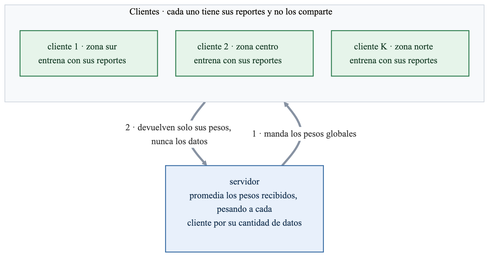

# Mini-TP 5 — Entrenar sin mover los datos

El mismo problema de los TPs anteriores, predecir si un crimen reportado en Chicago termina en arresto, pero entrenando de otra forma: cada cliente entrena con sus propios datos y solo comparte los pesos del modelo. Se compara contra el entrenamiento centralizado y se mide qué cuesta sumar privacidad.

← [README general del repo](../README.md) · [Mini-TP 1 (REST)](../tp1_rest/README.md) · [Mini-TP 2 (GraphQL)](../tp2_graphql/README.md) · [Mini-TP 3 (gRPC)](../tp3_grpc/README.md) · [Mini-TP 4 (streaming)](../tp4_streaming/README.md)

## Cómo correrlo

```bash
make fed-run
```

Compara las tres variantes e imprime el costo del ruido. El notebook agrega el gráfico de accuracy por ronda.

## Cómo funciona FedAvg



Cada ronda tiene tres momentos: el servidor manda los pesos globales a una parte de los clientes, cada cliente entrena unas épocas con sus datos, y el servidor promedia lo que recibe pesando a cada uno por su cantidad de filas. Sin esa ponderación, un cliente con cien filas movería el modelo tanto como uno con cien mil.

Participa el 60% de los clientes por ronda y no todos, porque en un sistema real no están todos disponibles siempre.

## Por qué no se federa el XGBoost

FedAvg promedia los pesos de los modelos locales, y un ensamble de árboles no tiene pesos que promediar. Lo que se federa es una regresión logística sobre las mismas 7 features del modelo del repo.

Eso cambia el punto de comparación: el XGBoost entregado llega a 0.912 de accuracy y este modelo lineal a 0.639. Lo que se compara acá es federado contra centralizado dentro del modelo lineal, no contra el modelo de producción.

## Los datos

Son 20.000 filas del dataset final del TP-final, con las 7 features y la etiqueta, versionadas comprimidas en `data/`. El dataset completo tiene casi 200.000 filas y no se versiona; la muestra la genera `prep/make_federated_sample.py`, fuera del entregable.

Las features se estandarizan con la media y el desvío del entrenamiento, porque conviven frecuencias del orden de las centésimas con coordenadas ya estandarizadas, y con esas escalas tan distintas el descenso de gradiente tarda muchísimo en converger. Es una simplificación: calcular esas estadísticas sobre todo el entrenamiento es un paso centralizado, y un sistema federado de verdad tendría que acordarlas sin juntar los datos.

## Las dos particiones

| partición | cómo reparte | qué representa |
|---|---|---|
| al azar | filas mezcladas entre los clientes | el caso fácil: todos ven una muestra parecida al total |
| por zona | franjas de norte a sur de la ciudad | el caso realista: los reportes de un distrito se quedan en el distrito |

Repartir por zona no solo separa la geografía: arrastra también la etiqueta. La tasa de arrestos por cliente va de 0.380 a 0.509, mientras que al azar queda entre 0.437 y 0.457. Esa disparidad es lo que le cuesta al promedio.

## Resultados

| variante | accuracy |
|---|---|
| centralizado | 0.6388 |
| federado, reparto al azar | 0.6388 |
| federado, reparto por zona | 0.6300 |

Con reparto al azar el federado iguala al centralizado: no cuesta nada no mover el dato. Con reparto por zona pierde 0.9 puntos, y además la curva oscila casi tres veces más entre rondas, porque cada ronda promedia un conjunto distinto de clientes que aprendieron de poblaciones distintas.

## El costo de la privacidad

Que los datos no se muevan no alcanza para decir que son privados: los pesos que manda cada cliente llevan información sobre las filas que los entrenaron. Sumarle ruido gaussiano al promedio la desdibuja, y cuesta accuracy.

| sigma | accuracy | mediana de 5 corridas | rango entre corridas |
|---|---|---|---|
| 0.0 | 0.6388 | 0.6388 | — |
| 0.05 | 0.6388 | 0.6400 | 0.6388 – 0.6408 |
| 0.1 | 0.6354 | 0.6378 | 0.6354 – 0.6422 |
| 0.2 | 0.6268 | 0.6322 | 0.6268 – 0.6406 |
| 0.5 | 0.6084 | 0.6160 | 0.6010 – 0.6300 |

Hasta 0.1 el costo no se distingue de la variación entre corridas. Desde 0.2 se nota, y en 0.5 son casi 3 puntos. Y hay algo que el promedio no muestra: la inestabilidad crece más rápido que la pérdida, así que con mucho ruido no solo se predice peor, sino que cada entrenamiento sale distinto.

Es la versión simple de privacidad diferencial, que es lo que la consigna pide como opcional. La formal además acota cuánto puede aportar cada cliente y lleva la cuenta del presupuesto de privacidad gastado entre rondas.

## El notebook

[`mini_tp5_federado_actividad.ipynb`](mini_tp5_federado_actividad.ipynb) es el starter de la cátedra completado, y se entrega ejecutado con sus salidas. Los `.py` de esta carpeta son la fuente y están cubiertos por tests; el notebook los importa y los muestra.

```bash
uv run jupyter nbconvert --to notebook --execute --inplace tp5_federated/mini_tp5_federado_actividad.ipynb
```

## Cómo está armado

| archivo | qué tiene |
|---|---|
| `data.py` | carga la muestra versionada y separa entrenamiento y evaluación |
| `model.py` | la regresión logística en numpy: pesos, gradiente, entrenamiento y accuracy |
| `partitions.py` | el reparto entre clientes, al azar y por zona |
| `federated.py` | FedAvg: entrenamiento local, agregación ponderada y las rondas |
| `privacy.py` | el ruido sobre los pesos agregados |
| `run.py` | el comando que corre las tres variantes y arma las tablas |
